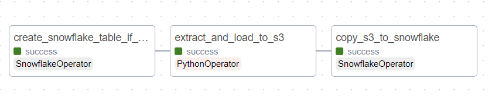
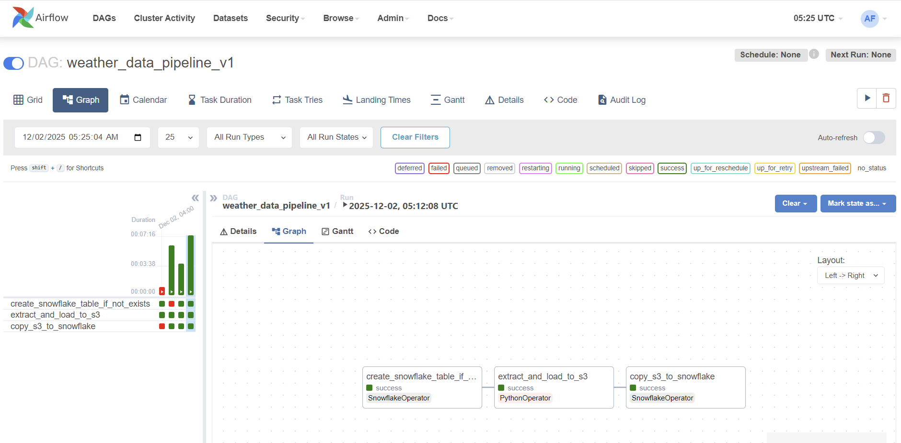

## 🚀 Building a Modern Data Pipeline: AWS, Airflow and Snowflake (Phase 1 Complete!)

Hey everyone! As a self-starting data engineer, I’ve been tackling a hands-on project to master the modern cloud data stack. I wanted to move beyond tutorials and build a robust, end-to-end (E2E) pipeline from scratch.

This post summarizes the setup and successful execution of **Phase 1** of my project: **The Global Weather Data Pipeline**.

### 🎯 Project Goal & Core Technology Stack

The primary goal of this project is to create an automated **ETL (Extract, Transform, Load) workflow** to ingest global data, process it in the cloud, and store it in a production-ready data warehouse for analysis.

Here's the powerful stack we chose to work with:

| Component | Technology | Role in the Pipeline |
| :--- | :--- | :--- |
| **Orchestration** | **Apache Airflow (v2.x)** | Schedules and manages the entire workflow (the **"brain"** of the operation). |
| **Cloud Storage** | **AWS S3** | Serves as the raw and staging **Data Lake** for all ingested files. |
| **Data Warehouse** | **Snowflake** | The final, powerful, and scalable destination for analytical data. |
| **Big Data Processing** | **Apache Spark** | (Future Phase) Cleans, validates, and transforms large datasets. |

## 🏗️ Phase 1: Overcoming Environment Hell and Achieving First Success

The first phase was dedicated to overcoming "environment hell"—the notoriously difficult process of getting all these complex systems to talk to each other.

### 1. The Power of Docker: Solving Dependency Nightmares

Initially, trying to install Airflow and its various dependencies directly on the EC2 server led to endless **dependency conflicts** (`ModuleNotFoundError`, `PermissionError`).

The key fix was the transition to **Docker**. We defined a clean environment using a `Dockerfile` and `docker-compose.yaml`. This successfully **isolated Airflow** and allowed us to install all necessary **Providers** (AWS, Snowflake, Spark) without conflicting with the host operating system.

### 2. Networking and Access Control Setup

We successfully configured the security and access layers:

* **Public Access:** Solved the tricky external connection issue by correctly configuring the AWS **Security Group** to allow traffic on port **`8080`** and utilizing a **Duck DNS** address.
* **Airflow Credentials:** We secured the system by setting up a managed **PostgreSQL** database (via Docker Compose) and successfully created the **`admin`** user account.
* **Cloud Connections:** We configured Airflow's **Connections** menu with the required **AWS IAM Access Keys** and **Snowflake User Credentials** to ensure secure communication.

## ✅ Phase 1: Pipeline Execution (E2E Success!)

After all the setup, we wrote our first basic Directed Acyclic Graph (**DAG**), named **`spark_weather_pipeline`**, and executed it successfully!

### The Successful Pipeline Flow:

1.  **Task 1: Table Creation** ($\rightarrow$ **Snowflake**): Executed a `CREATE TABLE IF NOT EXISTS` query to ensure the destination table exists.
2.  **Task 2: Extract & Load Raw** ($\rightarrow$ **S3**): A Python task generated dummy weather data and successfully uploaded it to our S3 bucket's **`raw/`** path using the `S3Hook`.
3.  **Task 3: Load Final Data** ($\rightarrow$ **Snowflake**): Used a `SQLExecuteQueryOperator` to run a **`COPY INTO`** command, pulling the data directly from S3 and inserting it into the appropriate Snowflake table.

**Status:** The entire three-step process ran green! The foundational ETL pipeline connecting **Airflow to S3 and then to Snowflake** is now fully functional.

## ⏭️ Next Steps: Bringing in the Big Gun (Apache Spark)

While the pipeline works, the current data transformation is basic. The next, most important phase is to integrate **Apache Spark** to handle advanced data cleaning and validation.

**The Current Challenge (and our next step):**

We are currently battling a **`JAVA_HOME`** configuration issue in the Docker container. The `SparkSubmitOperator` cannot find the required Java runtime environment to launch the Spark process successfully. We are working on modifying the Dockerfile and environment variables to ensure Java is correctly configured.

Once we resolve this Java configuration, we will successfully execute the **`spark_transform_data`** task, which reads data from S3, processes it with **PySpark** (running locally in the Docker environment for cost efficiency), and writes the clean data back to S3's staging area—the final step needed to showcase true **Big Data Engineering** competency! Stay tuned for Phase 2!

Below I added some pictures during this project. My first Airflow and Snowflake!
It looks complicated and I know that I will struggle.. But still I want to try to learn about these things.
Hope I can finish this project with success!

### still failing with three stages

### finally success!

### airflow full shot

### working on spark but failing :(

