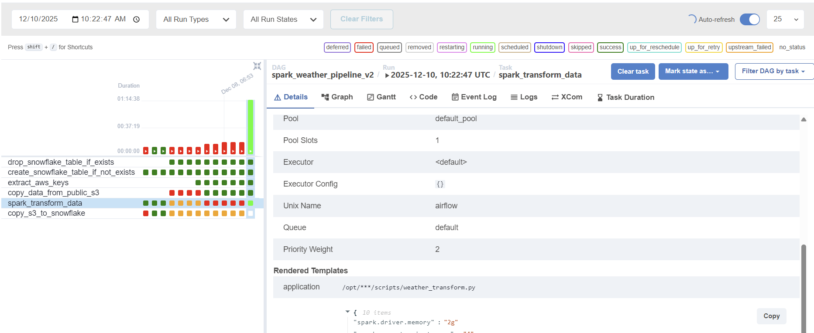

# Engineering Log: Why I Shelved My GHCN Data Pipeline (The Infrastructure Wall)

## 1. Introduction
This project was an ambitious attempt to build an automated ETL pipeline for the **GHCN (Global Historical Climatology Network)** dataset. The objective was to move data from a public S3 bucket, transform it with PySpark, and load it into Snowflake. However, the project met a definitive halt due to insurmountable performance bottlenecks on a single-node infrastructure.

## 2. The Final Architecture
- **Orchestration:** Apache Airflow
- **Storage:** Amazon S3 (Public Source & Private Raw/Staging)
- **Processing:** PySpark (Local Master Mode)
- **Data Warehouse:** Snowflake

## 3. The Challenges & My Attempts to Solve Them

### A. The "TabError" and Syntax Hurdles
Early in the project, I struggled with persistent `TabError` and `AnalysisException`. Debugging the inconsistent use of tabs and spaces in Python, and correcting the sequence of Spark transformations (like renaming columns before applying functions), were the first major hurdles.

### B. The Performance Bottleneck
The transformation task (`spark_transform_data`) consistently exceeded **1 hour**, even for relatively simple logic.

### C. Scaling Down: The Last Stand
To salvage the project without moving to expensive clusters, I attempted to **limit the data scope**:
- **The Attempt:** Modified the ingestion logic to copy only a single year's file (`limited_files = all_files[:1]`) instead of the entire dataset.
- **The Result:** Surprisingly, even with this drastically reduced data volume, the Spark execution time did not fall below the 1-hour mark.

## 4. Why It Failed: Deep Dive into the Bottleneck

1. **S3A Connector Overhead:** Running Spark in `local` mode on a single instance causes significant overhead when communicating with S3. The S3A filesystem client often struggles with high-latency I/O when not backed by a distributed cluster.
2. **Local Master Limitations:** In `local` mode, Spark lacks the parallel processing power of a distributed environment. Shuffling and partitioning even a small subset of GHCN data proved too taxing for a single EC2 instance's CPU and memory.
3. **Hardware Constraints:** The mismatch between the "Big Data" nature of the GHCN dataset and the "Small Data" capacity of a single-node Airflow worker created a performance ceiling that couldn't be broken by code optimization alone.

## 5. Key Lessons Learned
* **Infrastructure is King:** No amount of code optimization can replace the need for proper infrastructure (like AWS EMR) when dealing with Spark and S3.
* **The "Local" Trap:** `local` mode is great for unit testing logic, but it is a poor proxy for production performance, especially with cloud-native storage like S3.
* **Knowing When to Walk Away:** Recognizing that a project requires a fundamental architectural shift (e.g., moving to a distributed cluster) is a crucial skill for a Data Engineer.

## 6. Closing Thoughts
I am closing this project not because the logic failed, but because I reached the physical limits of my current environment. This experience taught me the stark difference between "writing Spark code" and "managing Spark infrastructure." My next venture will begin with a distributed-first mindset.

