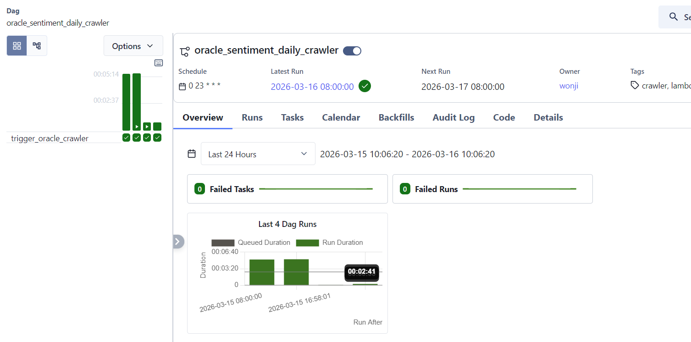
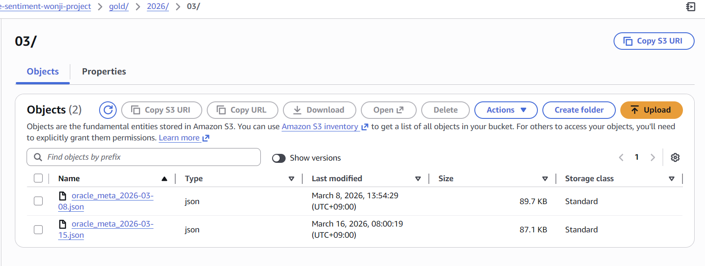

Yesterday's goal: Let's automize crawling process!
So, yesterday I set up EC2(ubuntu) in AWS and set up a Airflow inside that ubuntu.

I first looked for the Managed Airflow in AWS, but found out it is for big enterprises.
So I detoured to do on my EC2. 

Built my airflow_env inside that ubuntu, and the settings..

<code>
sudo apt update && sudo apt upgrade -y
sudo apt install python3-pip python3-venv -y
</code>
<code>
python3 -m venv airflow_env
source airflow_env/bin/activate
</code>
<code>
pip install apache-airflow
pip install apache-airflow-providers-amazon
</code>

---

And I wrote DAG to run the crawling daily in the morning.
Of course I already set up the AWS connection in Airflow.

Once it was succeeded, I made the Airflow to run in the background, so it won't stop even I turn off the ubuntu CLI.

<code>nohup airflow standalone > airflow_server.log 2>&1 &</code>

----------

And this is I saw in this morning!
It is working well, the DAG succeeded in 8am in the morning.

And the result is saved in S3. In the gold bucket.
I can see that the data for 15th was uploaded in this morning.

I am gonna wait for 2 weeks how it goes.
Why 2 weeks? Cause it is my maxinum budget for AWS.
EC2 costs a lot.. More than I thought. Maybe because I chose t3.small not micro (bc of the airflow)
